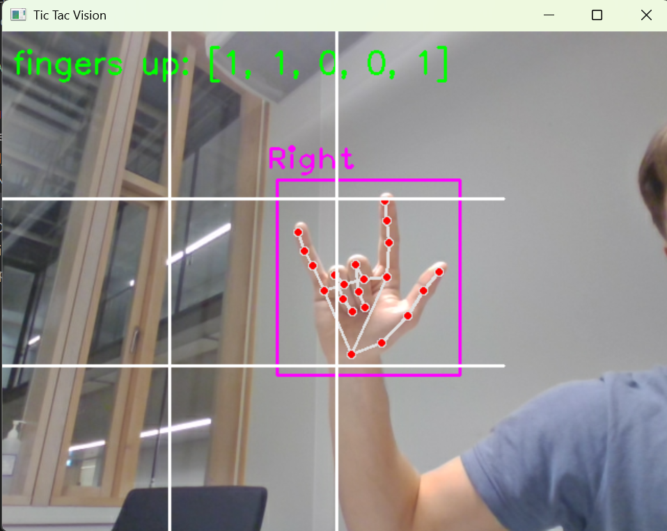
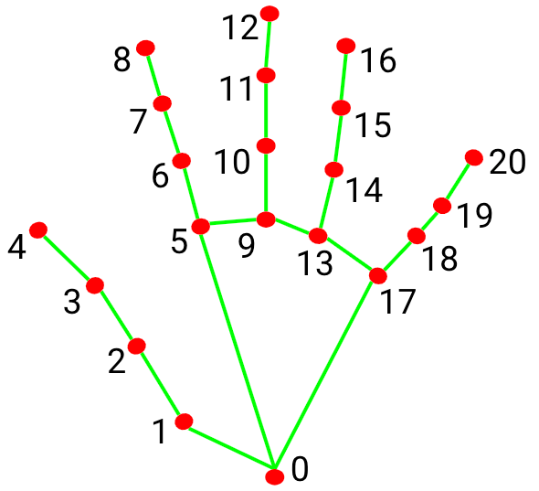
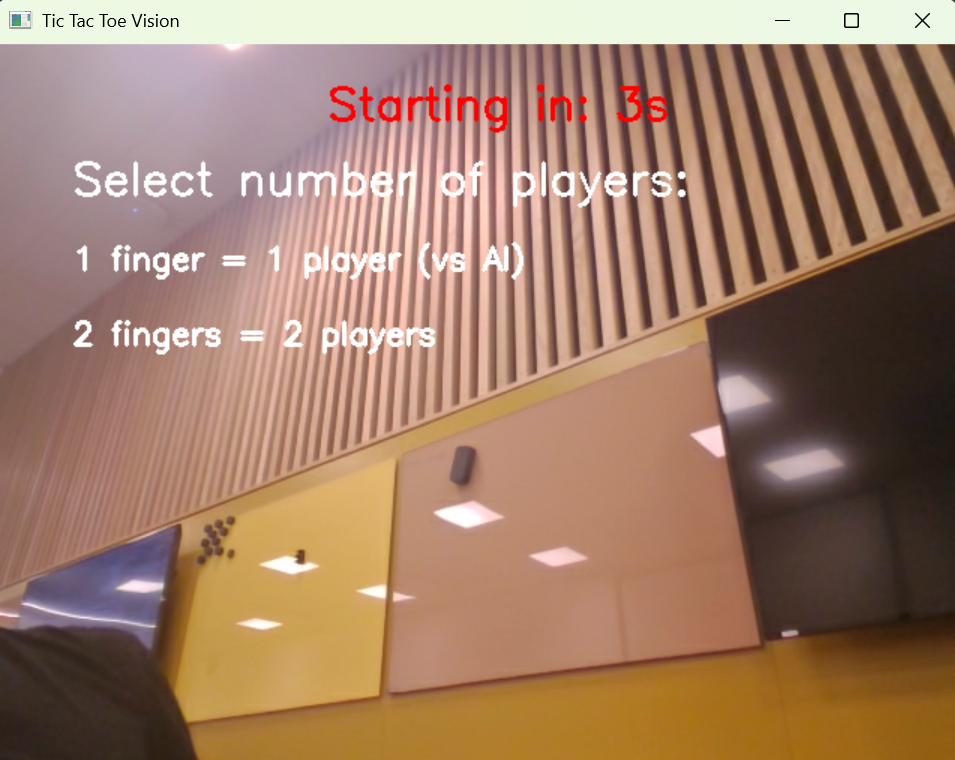
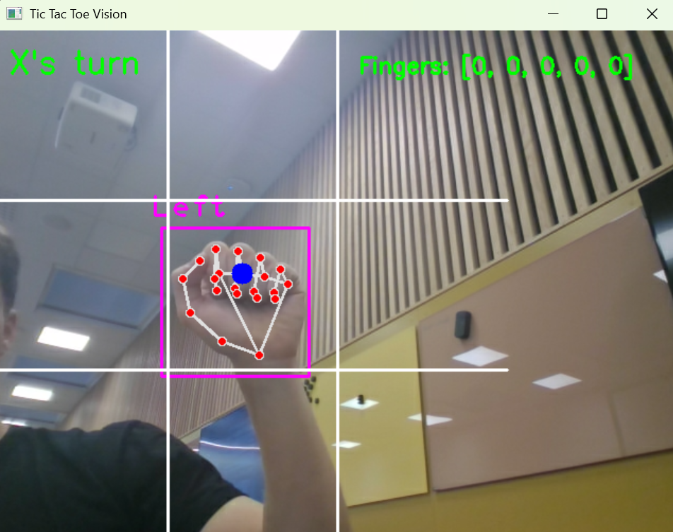
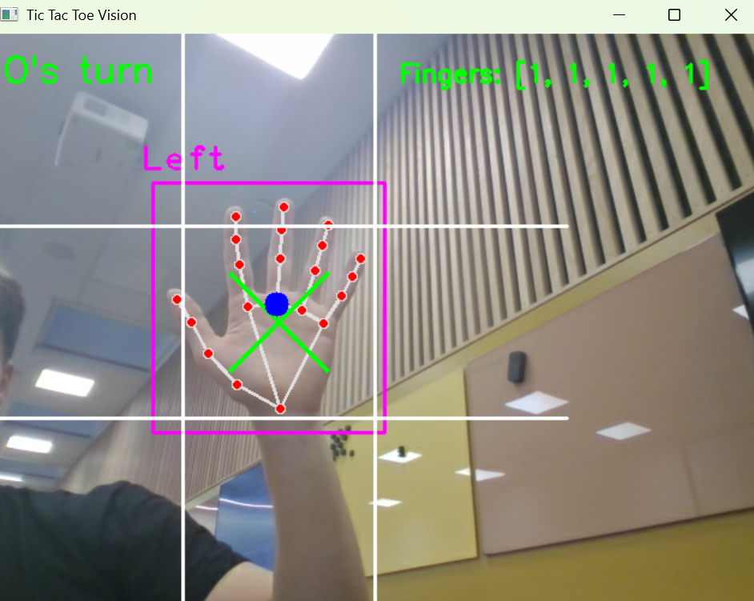
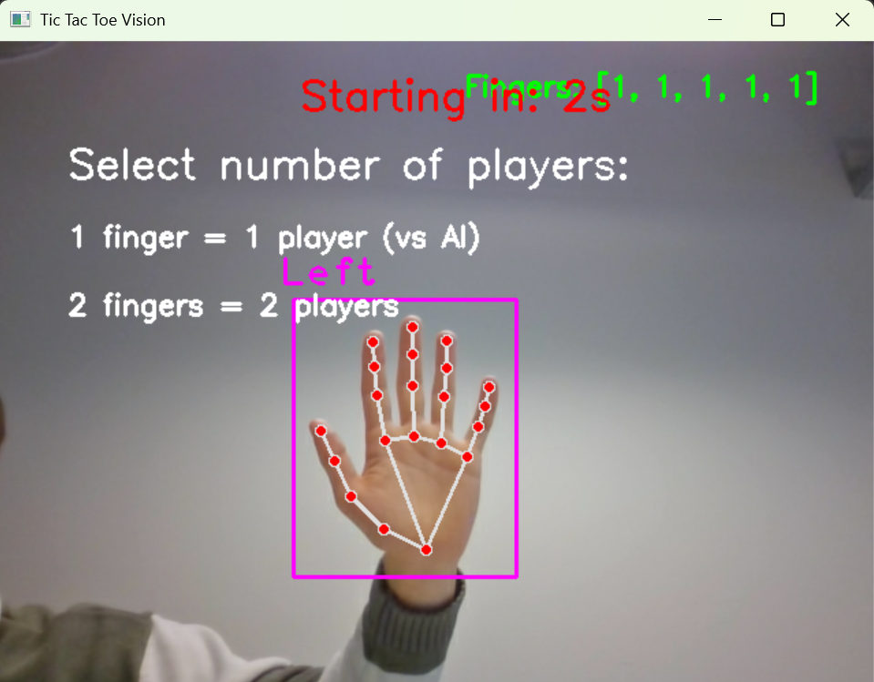
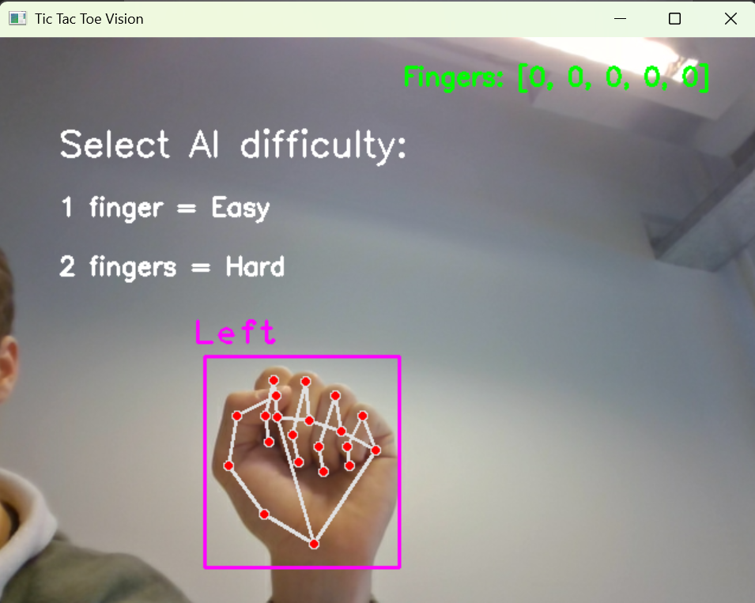
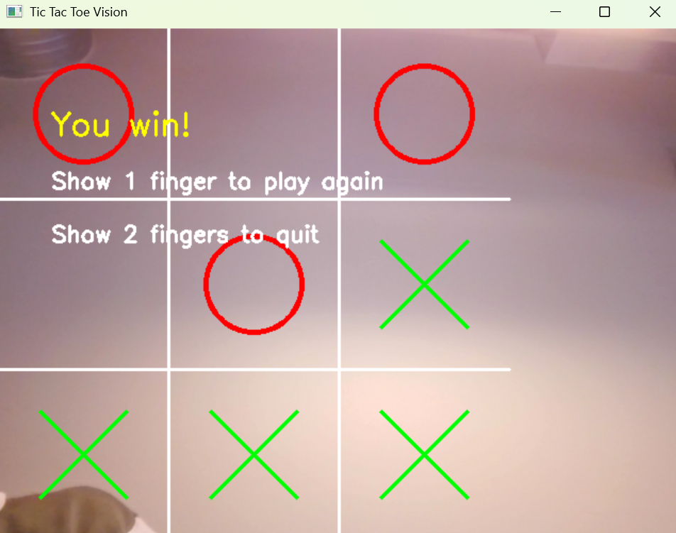

# Project Progress

This document shows the development progress of the Tic Tac Toe Computer Vision game across three main releases.

---

## Release 1

Initial prototype demonstrating **hand tracking and finger counting** using OpenCV and MediaPipe.  
The second image shows the **21 tracked hand landmarks** detected by the model.  
A basic **game board overlay** was implemented, but no gameplay logic or AI was included yet.

---

## Release 2

Introduced **two-player gameplay** and basic interaction through hand gestures.    
Focus was on gesture detection stability and mapping gestures to board positions.

---

## Release 3 (final)

Fully functional version with **working AI**, **gesture-based menu navigation**, and complete **Tic Tac Toe gameplay**.  
Players can choose between single-player or two-player modes, and restart or quit after a match.

